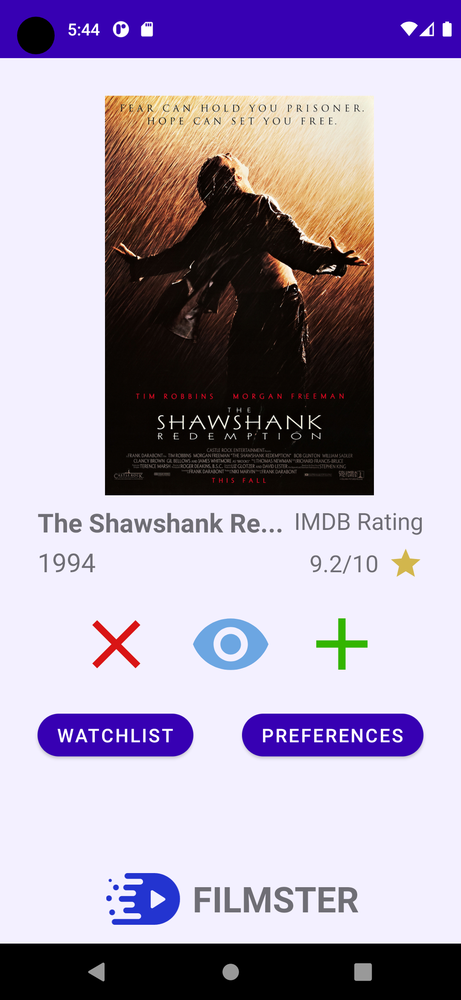
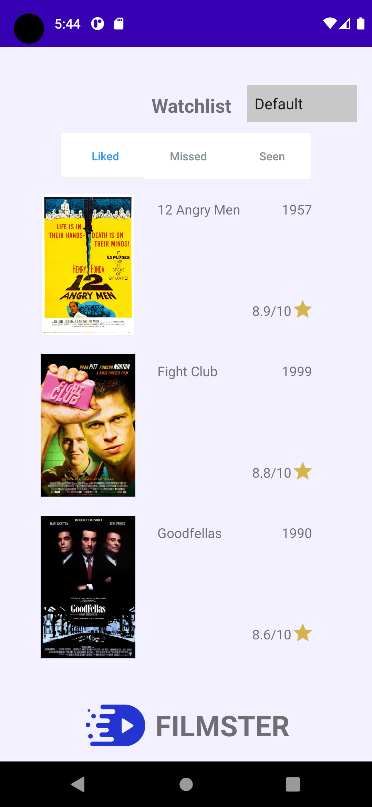

# Filmster
A project in TDA367 objectoriented programming project at Chalmers University of Technology.
 
## Introduction
It’s tedious to look for movies on Netflix and other similar streaming services. Therefore an application that helps movie enthusiasts find movies they have not yet seen. Kind of how Tinder helps people to match with similar people. Filmster wants to help people match with the right film for them. By using the IMDb API Filmster is able to offer up to 250 000 different movies and series for our users. Users can either choose to like, dislike or mark the movie as already seen. The movies are saved in the user's watchlist. The application will be very useful for people that watch a lot of, or have seen a great deal of films.
 
 
## Screenshots of the app

  
  
   

 
## Running the program
1. Download [Android Studio](https://developer.android.com/studio?gclid=Cj0KCQjwiNSLBhCPARIsAKNS4_fu01jUQ3hp_HuQX2DLo_WKVRkFxXBcmHBo8HOnO_61_di7xMR4OboaAkqLEALw_wcB&gclsrc=aw.ds).
2. Open the project in Android Studios.
3. Go into "Tools" > "AVD Manager".
4. Press "Create Virtual Device...".
5. Pick "Pixel 4", press "Next".
7. Press "Download" on the first recommended system image: "R | 30 | x86 | Android 11.0 (Google Play)", press "Next".
8. Press "Finish".
9. Choose "Pixel 4 API 30" next to "MainActivity" at the top in Android Studios.
10. Run the program.
 
